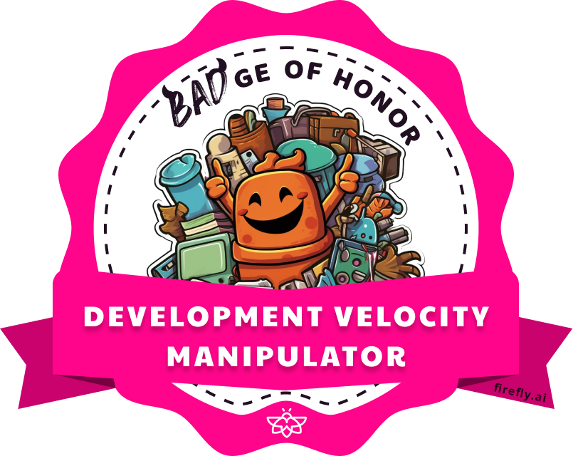
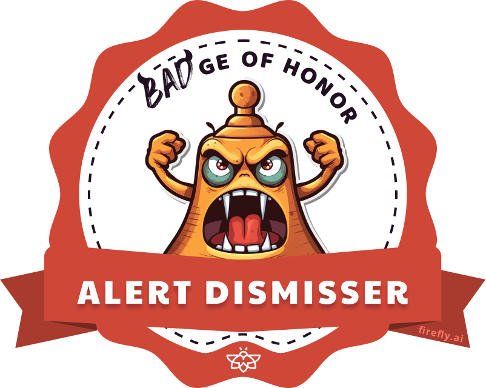

#  
# Which BADge do you deserve?
We all make mistakes - some worse than others.  Let's acknowledge our shared imperfections and find humor in them. Together we can foster a culture that celebrates our humanity and the lessons learned from our errors.
Award yourself, a friend, or a coworker one of Firefly's [BADges of Honor](https://www.firefly.ai/badges-of-honor)

## Software Engineering
#### Shift-Right Advocate

Prefers testing in production rather than shifting it left to the development phase, risking user-facing issues.

#### Development Velocity Manipulator

Artificially inflates or deflates development speed metrics to serve their narrative.

#### Job Security Specialist

Writes complex, hard-to-understand code to make themselves indispensable to the project.

#### Meetings Maestro

Spends more time in meetings than actual development, reducing productivity.

#### Git Push --force

A sly Code Review Hater, simply forces a code push bypassing all governance and policy automation.

#### Spaghetti Coder

Writes code with complex and tangled control structures, making it difficult to maintain and understand.

#### "Works on my Machine" Certified Developer

Dismisses bugs because the code works on their local setup, ignoring potential environment-specific issues.

#### WFH Napper

Prefers to take unexpected breaks during work-from-home, slowing down the team's progress.

#### Code Review Hater

Avoids code reviews, leading to unchecked code getting merged into the main branch.

#### Master of Non-Reproducible Defects

Creates bugs that are hard to reproduce, leading to wasted debugging efforts.

#### Legacy Code Enthusiast

Resists updating old, inefficient code, slowing down technological progress.

## Cloud Platform Engineering

#### ClickOps Specialist

Prefers doing everything manually via UI clicks, rather than automating it using IaC.

#### Cloud Waste Maintainer

Doesn't optimize cloud resources, leading to wasteful expenditures.

#### Infra Drifter

Changes infrastructure configuration directly through the web console, completely ignoring the IaC pipeline.

#### Master of Vendor Lock-In

Designs systems heavily dependent on a single vendor's technology, limiting flexibility and resilience.

#### Accidental TF Destroyer

Has a knack for unwittingly running "terraform destroy", erasing infrastructure components accidentally.

#### Cloud Cost Maximization Expert

Selects the most expensive cloud services without optimizing for cost.

#### Bare Metal Ambassador

Staunchly advocates for traditional, non-cloud-based solutions, often hindering modernization efforts.

#### Keeping Dev EC2 Running All Night

Forgets to shut down development instances leading to unnecessary cloud costs.

#### Cloud Complexity Coacher

Always selects the most complex solution over simpler, equally effective alternatives.

## Site Reliability Engineering

#### Distributed Monolith Architect

Creates a system that is theoretically distributed but in practice behaves as a single monolithic application.

#### Poor-Availability Architect

Designs systems that lack proper redundancy and failover mechanisms, leading to frequent downtimes.

#### Alert Dismisser

Ignores or turns off important system alerts, often leading to overlooked critical issues.

#### Off-Call Duty Officer

Avoids being on-call for support.

#### Unscheduled Maintenance Specialist

Frequently causes unplanned downtime due to their reckless approach to maintenance.

#### Inflexible Scalability Specialist

Designs systems that resist scaling causing performance bottlenecks and service outages during high demand.

#### Direct-to-Prod Promoter

Known for pushing changes directly to production, skipping important testing and staging environments.

#### Show-Stopper

Makes a big deal out of minor issues. Loves crisis management.

## SecOps
#### Home IP Whitelister

Ensures their home IP is always whitelisted, causing potential security issues.

#### Sock 2 Compliance

Uses this compliance certification as a shield to avoid implementing essential security practices.

#### S3 Bucket Exposer

Frequently leaves cloud storage buckets publicly accessible, risking sensitive data exposure.

#### Non-Compliant Compliance Expert

Talks a lot about compliance but fails to implement compliant practices.

#### Most Privileged

Always operates with the highest system permissions, disregarding the principle of least privilege.

#### Zero-Trust Skeptic

Rejects the zero-trust security model, risking unauthorized access and data breaches.

#### Always Run as Root

Regularly uses root or administrator access, disregarding the best practice of only escalating when necessary.

#### Cloud-Captive Security Specialist

Relies upon cloud-provided security features, overlooking potential security risks inherent in their code and architecture.

## Bonus Badge
#### Disclosure of Human Errors

Openly communicates their own or others’ mistakes in a way that may harm morale or trust within the team, instead of constructively addressing and learning from these errors in a private and supportive manner.